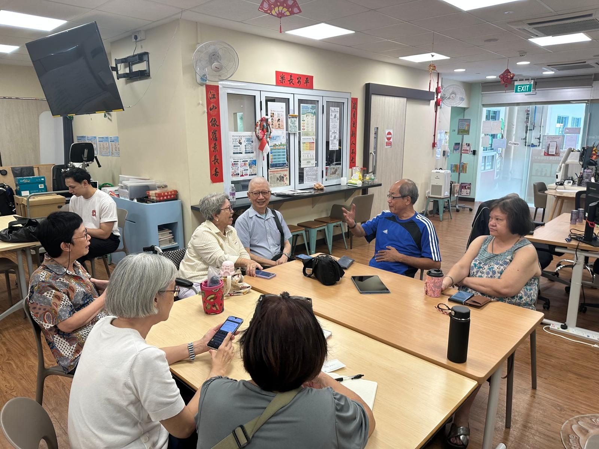
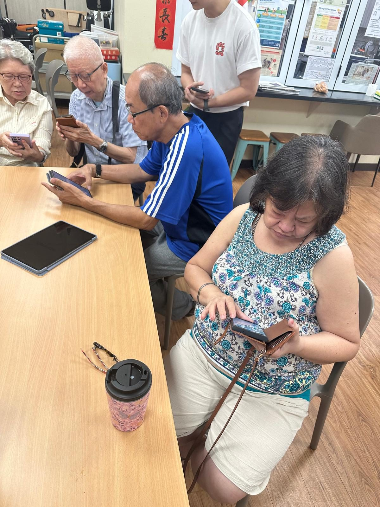
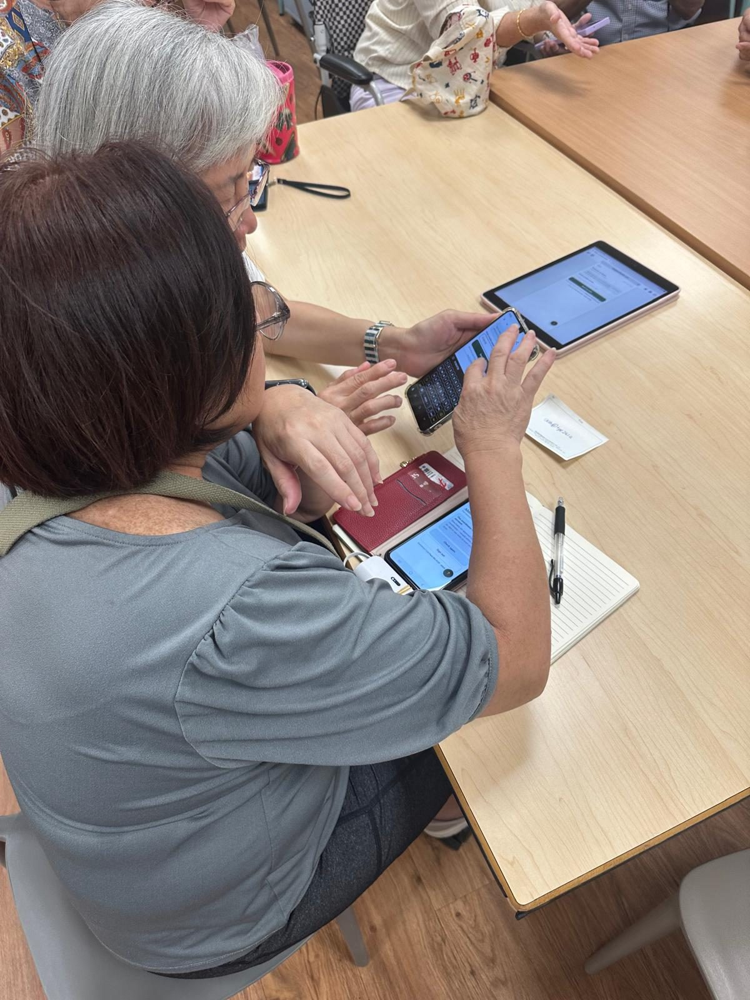
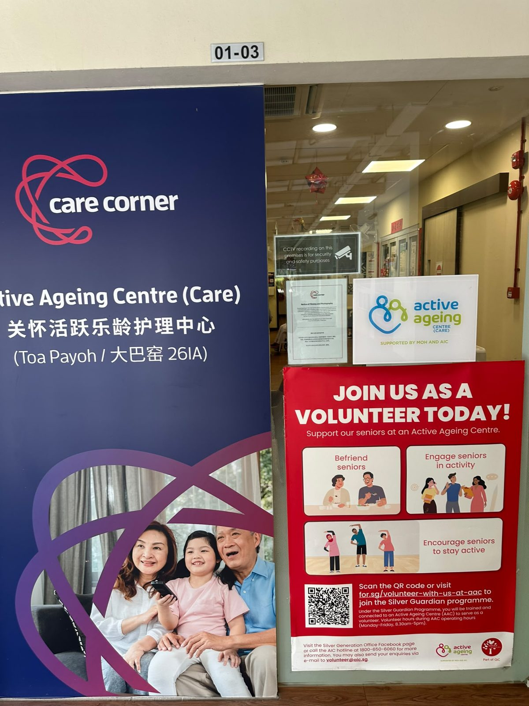

> **Source caveat.** This entry is stitched from three documents written after the session,
> not from a transcript. One is an auto-generated summary of the recording, and it contains
> figures ($14/hr → $9/hr, "$23 for two hours", a three-second SOS press) and claims ("IC
> verification, photo upload demonstrated") that don't match what the app actually does
> today. Where the summary and our own notes disagree I've gone with the notes and flagged
> the summary. The full recommendation register, deduplicated across all three sources, is
> in [[../prototype/tabletop-2026-08-21-feedback]].

The Table Top Exercise Vanguard proposed on [[2026-08-03-ncss-vanguard|Aug 3]] happened, eighteen days
later, at Care Corner's Active Ageing Centre (Care) in Toa Payoh 261A, with eight seniors and their own phones. Vanguard and NCSS
facilitated; three of us (Shobhit, Abhishek, Zheng Wei) ran the app, approved accounts live
from the coordinator screen, and watched. The participants were recruited as Aug 3 said they
would be — prior service users, chosen for tolerance — so everything below should be read
with that in mind: these are the friendliest possible users, and they still hit a wall
before they reached the sign-in screen.

## The arc of the session

- Getting online came first and took real time. Some participants couldn't reach wifi or
  mobile data without help. "Open Chrome" meant nothing; the instruction that worked was
  *go to Google and type singaporekakis.com*. They liked the name.
- Sign-up went through on email or SMS. Then the waiting-for-approval screen, which nobody
  understood — they didn't know whether to do something or wait. Abhishek was approving from
  the coordinator view in real time, so the wait was short, but the confusion was real.
- We walked the lifecycle as designed: caregiver books (service → urgency → trigger →
  details), coordinator assigns, kaki accepts, kaki arrives and enters the caregiver's
  4-digit start code, kaki ends with a report. Participants played caregiver and kaki roles
  across two or three groups.

- The subsidy numbers on screen (still `PLACEHOLDER` in `assumptions.json`) drew the most
  questions of any single thing: *how is it decided, is it means-tested, what if I don't
  want it, is three hours prorated from the two-hour block.*
- The start-code exchange was new to everyone and executed cleanly once explained. Nobody
  failed it. Several wanted a photo of the kaki as well or instead.
- Overall read from the facilitators: concept useful, platform has potential. From us: the
  concept survived; the onboarding did not.

## What we learned

The wall is *before* the product. Wifi, "what is a browser", a placeholder number in the
phone field that one participant spent a minute trying to delete because it wasn't her
number. None of this is in the app's module table, and all of it decides whether a senior
ever sees the booking screen. The Aug 3 argument that the bar is *"when people start using
Grab they don't need a session"* now has a measured answer: not this population, not yet.

Language is not a localisation ticket, it's a gate. Participants understood English and
still asked for Mandarin, and separately for Malay and Cantonese. The Aug 3 note that
Chinese localisation is "feasible" understates it.

The kaki sees too much and the caregiver sees too little. A kaki doing household chores was
shown the senior's age and wondered why; a caregiver about to let a stranger in was shown no
photo and asked to check an NRIC. Both are the same design question, which we'd half-answered
with the one-way start code: *what does each side need to know to trust the door opening.*
One participant put the demand side plainly:

> *"I need help, because I live alone, and I'm not sure when something might happen, and
> urgent help is needed."*

Another had used something like this days earlier — two people came over to play rummy-o
when she couldn't go out — and mentioned a uniformed companion service she couldn't name.
The demand isn't hypothetical and neither is the competition; we just don't know who the
competitor is.

Refresh is not a notification. After booking, caregivers had no idea how long a match would
take and went back to refresh the page. Kakis asked whether the app had to stay open to
receive work. Both are the same missing thing.

Money questions came from both sides. Caregivers asked how subsidy is determined and whether
they could decline it. A would-be kaki asked how to *waive* the income and just volunteer.
Nobody asked us about price; everybody asked us about the rules around price.

## What changed

- The prototype milestone is met in substance: the app was pressure-tested by real seniors
  a day after the Aug 20 date. What it wasn't tested against is Vanguard's six crisis
  triggers as such — the session ran planned bookings, not crises.
- The [[../prototype/kakis-app]] "fit for a supervised tabletop" claim is now evidence,
  not assertion, and it comes with a list. The two hard rules held (no ratings surfaced,
  the kaki never saw the code). The auto-summary's suggestion of a *rating* filter in
  matching is a reminder that the no-ratings rule needs restating every time.
- Cancellation, which the SPEC treats as a pre-arrival action, is now a lifecycle question:
  after match, after the code exchange, mid-visit, with a compensation and liability
  question attached that nobody in the room could answer. Neither could we.
- Three new field-level asks that didn't exist before this session: kaki gender preference,
  kaki photo, and a dual caregiver-and-kaki sign-up.

## The venue

Care Corner Active Ageing Centre (Care), Toa Payoh 261A, unit 01-03 — a sister centre to
the Toa Payoh 170 AAC where we did the
[[../humans/2026-05-25-elderly-gentleman-toa-payoh-aac|May field interview]]. An AAC
activity room: two long tables, a TV on the wall, the week's programme on the pinboard,
Care Corner staff in the background. The participants are AAC members, which is a
different population from Vanguard's ICCP users in Pasir Ris — see [[../landscape/care-corner]].
One thing to settle before round 2: Aug 3 had Vanguard arranging one session and
NCSS/Care Corner the other. This one was at Care Corner. Whether a Vanguard-side session
with ICCP participants is still owed is the open question.

## What's next

- Work the register in [[../prototype/tabletop-2026-08-21-feedback]] into SPEC amendments,
  module by module, before writing code. The onboarding items (approval-wait copy, placeholder
  number, "caregiver" label, browser instructions) are the cheapest and gate everything else.
- Mandarin first, then Malay and Cantonese. Decide whether this is M-CORE or a new module.
- Define the subsidy rule with Vanguard and NCSS (means test, flat type, or opt-out) so the
  app can show gross and net before a caregiver confirms. Until then the placeholder label
  stays, and it stays loud.
- Answer the cancellation and liability question as policy, then encode it.
- Schedule a second round with the same group, per the facilitators' ask, to validate the
  changes rather than discover new ones. The NCSS/Care Corner session from Aug 3 is still to
  be arranged.
- Execute and document the pilot data deletion we promised in the room.

*Connects to:* [[../prototype/tabletop-2026-08-21-feedback]] · [[../prototype/kakis-app]] ·
[[../landscape/care-corner]] · [[../images/README]] ·
[[2026-08-03-ncss-vanguard]] · [[2026-08-03-himmat-review]] · [[../reframing/hmw-current]] ·
[[../reframing/devils-advocate]]
