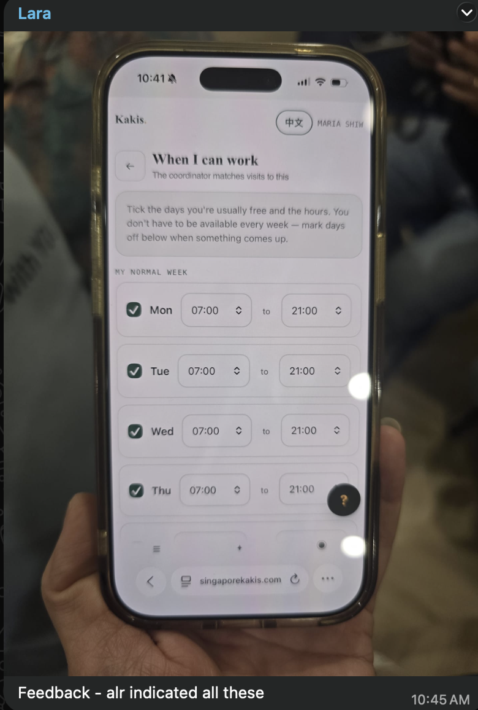
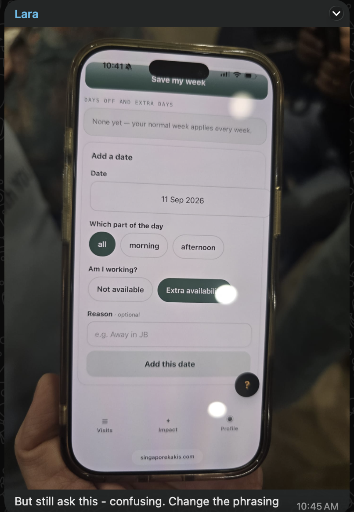
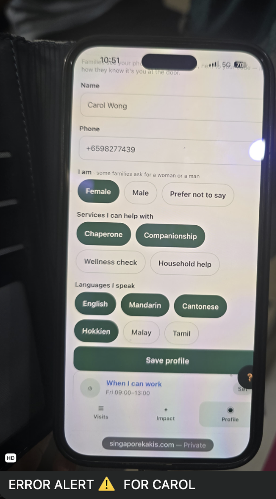
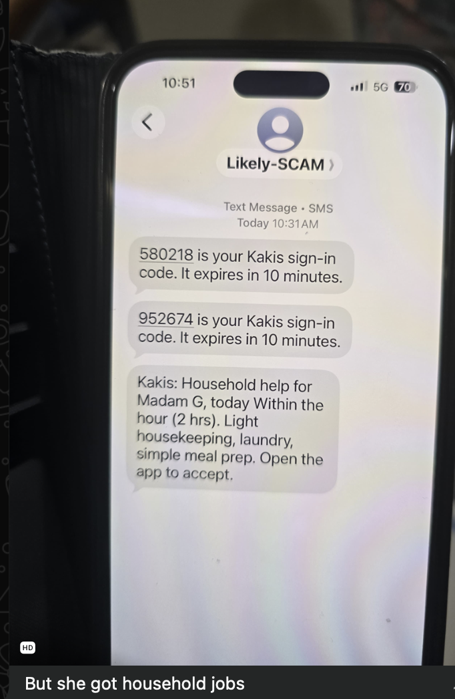
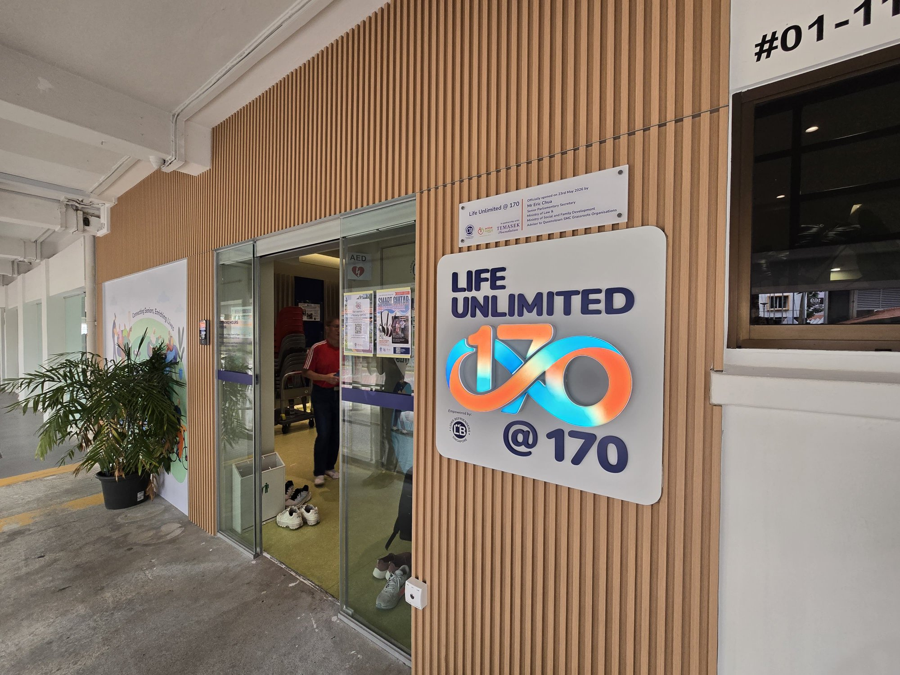
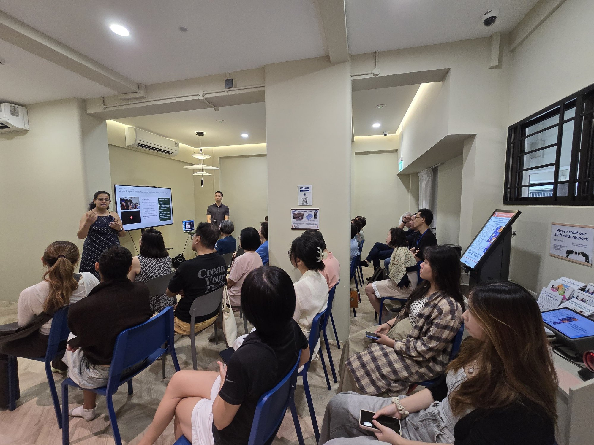
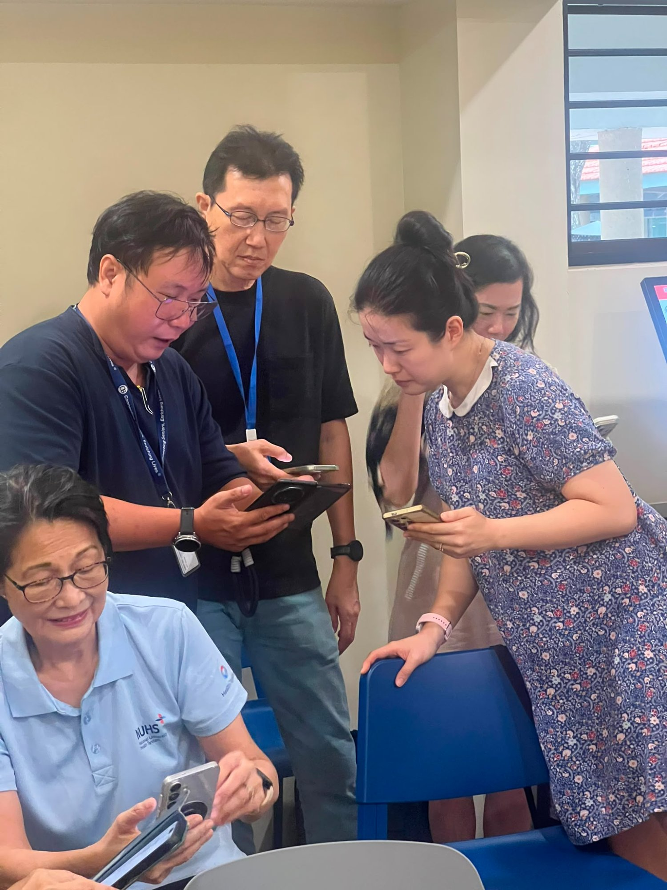
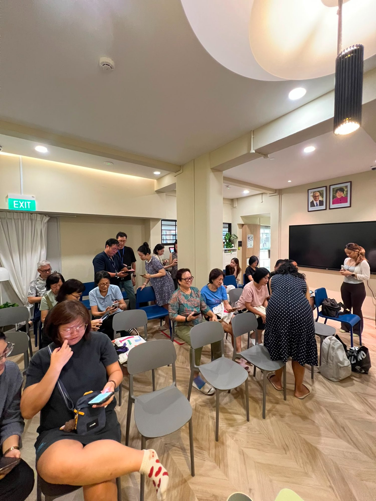

The second outside feedback session on the live app, at Lions Befrienders on 11 Sept
2026, three weeks after the [[tabletop-2026-08-21-feedback|Care Corner Table Top Exercise]]
and six days after v1.6 and v1.7 shipped. The session account is
[[../journal/2026-09-11-lions-befrienders-beta]].

**Read this first.** The notes we received for this session repeat the Aug 21 team notes
almost line for line (same items, same order, same wording, down to "the dummy number in
a box in grey"). Two readings are possible: the same observer used the Aug 21 sheet as a
checklist and confirmed each point with a new group, or the wrong file was attached.
Until that is settled, this register does two things: it records every item as received,
and it says against each one what the app *already* does as of v1.7. Where an item is
already built, the useful question for the next session is whether the Lions group saw
the new version or the old one. More feedback is being added as it arrives; the "Raw
notes" section at the end is the verbatim record.

Status column: **shipped** = live in v1.6 or v1.7 · **partial** = some of it live ·
**open** = still on the [[roadmap]] · **policy** = a partner decision, not code.
Cross-reference in brackets is the Aug 21 register item.

## 1. Getting in

| # | Item as received | Aug 21 | Status as of v1.7 |
|---|---|---|---|
| L1.1 | Used their own phones; some needed help to get onto wifi or the internet | 1.1 | out of app · printed connectivity step still needed |
| L1.2 | "Chrome / browser" not understood; *go to Google and type* worked | 1.2 | out of app · onboarding card wording |
| L1.3 | Liked the name singaporekakis.com | 1.3 | note |
| L1.4 | After sign-up, didn't know what to do before approval | 1.4 | **shipped** v1.6 · waiting screen says "Nothing to do right now"; a kaki can add certificates meanwhile |
| L1.5 | Want to sign up as both kaki and caregiver | 1.5 | open · Bucket 3, an auth change |
| L1.6 | "Caregiver" is a confusing word | 1.6 | open · a plainer label or a "for myself / for someone" fork; now also a 中文 question (照顾者) |
| L1.7 | A greyed dummy number in a box; one person kept trying to delete it | 1.7 | **shipped** v1.6 · no placeholder; hint text sits above the field |

## 2. Language

| # | Item as received | Aug 21 | Status as of v1.7 |
|---|---|---|---|
| L2.1 | Caregiver wants Cantonese as an option | 2.3 | **shipped** v1.6 · Cantonese on the language list for kakis and bookings |
| L2.2 | (not in these notes, carried from Aug 21) Mandarin UI | 2.1 | **shipped** v1.7 · 中文 on caregiver and kaki screens; console English |

## 3. Booking

| # | Item as received | Aug 21 | Status as of v1.7 |
|---|---|---|---|
| L3.1 | Exact start and end time | 3.1 | **shipped** v1.6 · 30-minute steps |
| L3.2 | 3 hours instead of 2, is it prorated | 3.2 | **shipped** v1.6 · charged by the half hour, one-hour minimum |
| L3.3 | Unsure which fields to fill | 3.3 | **shipped** v1.6 · required / optional marked |
| L3.4 | Specify kaki gender | 3.4 | **shipped** v1.6 · female / male / no preference, honoured by roster and auto-match |
| L3.5 | Ask for the same person again; a choice of kaki | 3.7 | **shipped** v1.6 · "someone they know" chips from past kakis; choice beyond that stays with the coordinator |
| L3.6 | Free text: curtains, will the kaki bring a ladder | 3.6 | partial · notes are shown to the kaki before the visit; matching does not read them |
| L3.7 | Late night / SOS | 3.9 | open · an operating commitment first (roadmap "Further out") |
| L3.8 | Other services: a person in uniform who sits with a couple, doesn't cook | new | note · candidate for `landscape/` once the service is named |

## 4. Notifications and the wait

| # | Item as received | Aug 21 | Status as of v1.7 |
|---|---|---|---|
| L4.1 | How long until a match; had to refresh; want push / pop-ups / live refresh | 4.1, 4.2 | partial · "usually matched within …" shown; SMS/email on every state change; live-updating screens and push are Bucket 3 |
| L4.2 | Reminder when the kaki arrives | 4.3 | **shipped** v1.6 · "I'm on my way" message; no ETA |
| L4.3 | Kaki should know the hours when a request arrives | 4.4 | **shipped** v1.6 · assignment message carries hours and task |
| L4.4 | Kaki unsure whether to keep the app open | 1.8 | **shipped** v1.6 · home screen says so; messages arrive by SMS/email |

## 5. Verification, safety, privacy

| # | Item as received | Aug 21 | Status as of v1.7 |
|---|---|---|---|
| L5.1 | Caregiver wants the kaki's photo | 5.1 | **shipped** v1.6 · photo on the visit page next to the kaki code |
| L5.2 | OTP exchange new but executed fine once explained | 5.2 | **shipped** v1.6 · now both ways (kaki code, then start code), explained on the screen where it happens |
| L5.3 | Kaki sees too much, e.g. age for household chores | 5.3 | **shipped** v1.6 · household-help visits minimised for the kaki |
| L5.4 | How do we know the kaki is genuine; one wants to check NRIC | 5.4 | partial · photo + per-visit code prove *this* person is the matched one; identity behind the profile is the coordinator's approval and certificates; Singpass is roadmap "Further out" |
| L5.5 | Privacy / data concerns | 5.5 | open · consent text, plain privacy copy, deletion path (PDPA review) |

## 6. Money

| # | Item as received | Aug 21 | Status as of v1.7 |
|---|---|---|---|
| L6.1 | Subsidy by means? What if I don't want it? | 6.1, 6.3 | policy · Vanguard/NCSS to state the test; every figure still says *placeholder* |
| L6.2 | Kaki wants to volunteer, how to waive income | 6.4 | policy + open |
| L6.3 | Cost / how subsidy is determined (several questions) | 6.1, 6.2 | policy · gross and net before confirming waits on the rule |

## 7. Cancellation and liability

| # | Item as received | Aug 21 | Status as of v1.7 |
|---|---|---|---|
| L7.1 | Caregiver may want to cancel even after the OTP exchange | 7.2 | **shipped** v1.6 · either side, after accept or mid-visit, with a reason |
| L7.2 | Who compensates if the caregiver cancels just before or after the kaki arrives | 7.3 | policy · the app records who and why; compensation is the coordinator's decision |
| L7.3 | Liability in general | 7.4 | policy · ties to the MOU question open since Aug 3 |

## Quotes and observations as received

- "Caregiver" seems a bit confusing.
- *"I need help, because I live alone, and I'm not sure when something might happen, and urgent help is needed."* (lady, short hair, patterned shirt)
- *"I used something like this just a few days ago. We couldn't go out, so two of them came over to play rummy-o."* (one of the ladies; likely the one giving care)
- A few questions on cost, subsidy, and how subsidy is determined.
- If I need 3 hours instead of the pre-determined 2, is the price prorated?
- Add the kaki's gender so the caregiver has one more data point.
- A reminder when the kaki arrives.
- When a kaki receives a request they should know the hours.
- Caregivers want to see the kaki's photo.
- Caregivers want a choice of kaki, and to be able to cancel.

## 9. Batch 2 — Lara's screenshots and Abhishek's four points (received 2026-09-20)

Six phone photos from the room (Lara, WhatsApp, 10:41–10:51 on the day) and a 30-second
video. These settle the source question for the build: the **中文 button is on screen**,
so the Lions group was on v1.7. Photos in `images/2026-09-11-lb-0*.png`; video in
`evidence/sources/`.

| # | Item | Module | Status | What we know |
|---|---|---|---|---|
| L9.1 | **A kaki who did not sign up for household help was matched to a household-help visit.** Carol Wong's profile: Chaperone + Companionship only. Her SMS: "Kakis: Household help for Madam G, today Within the hour (2 hrs)…". | M-ADMIN, M-VISITS | **bug / gap** | The roster carries `service_ok` per kaki and scores it (+10), but manual assign does not stop or warn when it is false, and the auto-matcher prefers but does not require it. Ask: block, or make the coordinator confirm past an explicit alert. |
| L9.2 | Availability is asked for in two places. The profile card "When I can work" (with a summary) and the separate availability screen; testers said they had "already indicated all these". | M-USERS | confusing | Same data, two entry points: the card is a link to the screen, but reads as a second form. Fold the summary into the screen's title, or move the week grid onto the profile. |
| L9.3 | "Days off and extra days · Am I working?" still asked after the week is set; phrasing confusing. | M-USERS | copy | The exceptions block should read as optional and dated: *"Different on a particular date? Add it here."* Chip labels *Not available* / *Extra availability* → *Day off* / *Extra day*. |
| L9.4 | Gender: stick with two options, remove *Prefer not to say*. | M-USERS | decision | Alan Chen's profile shows it selected. Backend already accepts ''; frontend chip to go. |
| L9.5 | Task wording to be more *atas* (more polished). The assignment SMS reads "Light housekeeping, laundry, simple meal prep." | M-CORE (`assumptions.json` notes), notify | copy | The task line comes from the coordinator-editable service note; rewrite the four notes in a warmer register, en and zh. |
| L9.6 | The sign-in SMS arrives from a sender the phone labels **"Likely-SCAM"**. | out of app (SMS provider) | ops | Sender ID not registered with the SG SMS Sender ID Registry, so the carrier flags it. Register "Kakis" (or route via a partner's registered ID) before any session without a facilitator in the room. |
| L9.7 | Alan's phone: 7 days ticked 07:00–21:00; Carol's: Fri 09:00–13:00; one profile shows Mon/Tue/Wed/Thu split hours. Availability entry works; the doubt was only where to enter it. | M-USERS | works | |

*Abhishek's four points, verbatim:* (1) why are there two places where a kaki has to give
availability; (2) gender "prefer not to say" remove; (3) task wordings to atas; (4) check
if the work the kaki says they can do is the work matched; if manual match then there
should be an alert and the match-making person should accept.

## 10. Batch 3 — the WhatsApp group thread, 10:58–11:43 (received 2026-09-20)

Lara relaying from the room in real time (`images/2026-09-11-lb-07`, `-08`). A
participant, Christina We, listed what matters to her: **loneliness, ageing at home
safely, getting help quickly, community building, neighbours and trust.** Then feedback in
five bursts.

| # | Item as received | Module | Status | What we know |
|---|---|---|---|---|
| L10.1 | Book multiple appointments or tasks at the same time | M-VISITS | open | One booking = one visit today. A repeat / series booking is new. |
| L10.2 | "As a caregiver I have MANY elderlies to take care of. Not a 1:1 mapping." | M-CARE | open · design | One household per caregiver since v1. Multi-household is the mirror of Aug 21 item 1.9 (many caregivers, one senior); together they are a data-model change. **The most important new item in the session:** LB staff and befrienders are caregivers-of-many, and so are most family caregivers with two parents. |
| L10.3 | "Urgent" does not allow more than 2 hrs; 3–6 hrs needed | M-VISITS | gap | Urgent and Soon use a preset window; only Planned takes exact times. Let urgent bookings carry a duration (or start/end) too. |
| L10.4 | Raise an alert for a dangerous situation: senior abusive to kaki, or the other way round | M-VISITS, M-ADMIN | partial | Kaki has "Flag a concern" after a completed visit; caregiver has a private care note. Neither is a live, mid-visit alert that reaches a human now. Ties to the SOS line (L3.7) and the liability question. |
| L10.5 | Slow SMS | ops | note | Sign-in codes took long enough to notice; same provider that carries the "Likely-SCAM" label (L9.6). |
| L10.6 | Every user both kaki and caregiver | M-AUTH, M-USERS | open | Repeats L1.5 and Aug 21 1.5; third session to ask. |
| L10.7 | Free text to create new tasks | M-VISITS | partial | "Other — tell us" exists on the trigger step; the four services are fixed. A free-text *service* is a matching question (who is qualified?), not just a field. |
| L10.8 | Caregiver has more to fill in; "a bit troublesome" | M-CARE, M-VISITS | note | Household + care plan + booking is three forms before a first visit. Could default more and ask less on the first booking. |
| L10.9 | If the kaki pays first for the ride (taxi for a chaperone visit), reimbursement must be possible | M-VISITS, money + policy | open | The estimate has a transport line for the kaki's fee; there is no out-of-pocket claim. Policy first (who approves, cap), then a field on the report. |
| L10.10 | "Volunteers are daunted by the visits, they don't last long (Homage)" | landscape | note | Retention of paid volunteers is a known problem at a competitor; supports the consistency argument in `strategy/`. |
| L10.11 | Transportation costs | money + policy | note | Same as L10.9 from the other side: who pays the kaki's own travel. |
| L10.12 | "Befrienders" available; "village chiefs" = visiting (NUHS and LB) | landscape | note | LB and NUHS already run befriender and "village chief" visiting roles; a supply pool, and a naming convention we should learn. Add to `landscape/lions-befrienders`. |
| L10.13 | "App too difficult and atas to navigate" | M-CORE (copy, IA) | open | Direct contradiction of Abhishek's "task wording to atas" (L9.5): one voice wants the language plainer, one wants it more polished. Resolve by audience: plain on the senior-facing screens, polished only in the SMS the kaki gets. |
| L10.14 | **Do not reveal full name. No phone number either.** "Seniors call out of the blue, hound you forever." Dangerous. PDPA. Security. | M-VISITS, M-USERS | **gap** | Today the caregiver sees the kaki's full name and can tap "Call {first name}" (phone exposed); the kaki sees the senior's name and address. A befriender with experience of being hounded says this is unsafe. Options: first name + last initial, calls routed via the coordinator, or a masked number. Needs a decision before the pilot. |

Two closing lines from Lara: *"Folks still had a lot of stories and warnings to share with me"* and *"Thank you all for today!"*

## The room

Life Unlimited @ 170, Lions Befrienders' active ageing centre in Queenstown (opened 23 May
2026, Temasek Foundation partnership). A briefing on the SGLN journey and the Vanguard
validation, then phones out. NUHS staff were in the room alongside LB befrienders.

## What is new against Aug 21

From batch 1, only two lines have no counterpart in the Aug 21 register: the uniformed
sit-with-a-couple service (L3.8) and, arguably, the sharper framing of the NRIC question.
Batch 2 is all new: a real mismatch bug (L9.1), the double availability entry (L9.2,
L9.3), the gender chip (L9.4), task wording (L9.5) and the scam-flagged SMS sender (L9.6).
Batch 3 adds the three that change the model: **a caregiver with many seniors (L10.2)**,
**names and numbers hidden between kaki and family (L10.14)**, and urgent visits longer
than two hours (L10.3); plus repeat bookings, a mid-visit danger alert, reimbursement of a
kaki's out-of-pocket transport, and the note that Homage's volunteers don't last. Of the 26 items received, 14 are already shipped, 3 partial, 4 open, and 5
are partner policy. If the Lions group tested v1.7, then the striking finding is that the
same asks came back after they were built, which would mean the fixes are not visible
enough on the screen. If they tested an older build or these are the Aug 21 notes, the
next session should be run on v1.7 with this table in hand.

## Raw notes as received

Verbatim, in the order received. More is appended as it arrives.

*Batch 1 (docx, "(2026_09_11) SGLN Meet @ Lions Befrienders - Beta Testing Session")*

- Used their mobile phones but some needed help to get access to wifi or connect to internet
- Don't understand chrome / browser but had to mention: go to Google and type to access
- They liked the name Singaporekakis.com
- Sign-up: didn't know what to do before they are approved as a user
- Sign-up: want option to signup both as kaki and caregiver
- Caregiver: want Cantonese as well as an option
- Caregiver requesting help: need to be able to provide exact start and end time
- Caregiver requesting help: they were unsure which fields to fill in vs not to fill in
- Caregiver requesting help: want ability to specify gender of kaki as they may not want a man to visit etc
- Caregiver: after requesting, not sure how long it will take to get a match. They had to go back and refresh to see the matches. Ideally we would need real time PN / pop-ups and screen refresh
- Caregiver: want to see photo of the kaki assigned
- Kaki: unsure if they need to keep the app on all the time or not to get assignments
- Kaki: sees too many details, for example may not need to know the age of the elderly if doing household chores. This will be a tricky one for us to think through
- Kaki / caregiver: the OTP exchange flow is something very new to them while no actual issues to execute when they know
- Caregiver: may want to cancel even after OTP exchange
- Caregiver: will subsidy be based on means? What if I don't want subsidy?
- Caregiver: ask for ability to request the same person again
- Kaki: what if I want to volunteer and not earn, how do I waive off the income?
- Some discussions on liability
- Some questions on what happens if caregiver cancels right before kaki arrives or after kaki arrives. Who compensates?
- Some concerns on privacy / data as well. One caregiver asked how the platform ensures that kakis showing up are genuine. One caregiver asked she would want to validate the NRIC of the person who shows up
- Mentioned other services where a person comes and takes care of an elderly couple; the kaki doesn't cook for this couple, just spends time with them. They didn't know the name of the service but the person comes in uniform
- Questions on free text field in the request form. Like if they want someone to come and change the curtains, will that be taken into account in matching? Will the kaki bring a ladder?
- Ask for late night / SOS request
- Don't remember which box, but there was a dummy number in a box in grey/background for them to fill their number and one person got confused as it wasn't their number and they kept trying to delete the number
- Then the ten numbered quotes and asks listed above.

*Batch 2 (WhatsApp, Lara, 11 Sept 10:45 and 10:51; Abhishek's notes 20 Sept)*

- "Feedback - alr indicated all these" (over the week grid)
- "But still ask this - confusing. Change the phrasing" (over Days off and extra days)
- "Gender. Stick w 2. remove PREFER NOT TO SAY"
- "ERROR ALERT ⚠️ FOR CAROL" · "She did NOT sign up for household" · "But she got household jobs"
- Abhishek: the four points above.

*Batch 3 (WhatsApp group, Lara, 11 Sept 10:58–11:43)*

- Christina We: Loneliness / Ageing at home in a safe / Getting help quickly / Community building / Neighbours and trust
- FEEDBACK 1. Can we book multiple appts or tasks at the same time 2. As a Care Giver, I have MANY elderlies to take care of. SO IT'S NOT A 1:1 MAPPING 3. "URGENT" option currently does NOT allow more than 2 hrs. But is needed for 3 ~ 6 hrs
- ANOTHER FEEDBACK: WE SHOULD BE ABLE TO RAISE ALERT FOR A DANGEROUS SITUATION WHERE THE SENIOR IS ABUSIVE OR THE OTHER WAY AROUND
- FEEDBACK 1. SLOW SPEED W SMS 2. CAN WE ALLOW EVERY USER TO BE BOTH KAKI & CARE GIVER 3. FREE TEXT TO CREATE NEW TASKS 4. CARE GIVER MORE THINGS TO FILL IN, BIT TROUBLESOME
- FEEDBACK: IF THE KAKI PAYS ON BEHALF OF THE CAREGIVER OR ELDERLY FIRST FOR THE RIDE, THEN WE NEED TO ENABLE THE REIMBURSEMENT
- Volunteers are daunted by the visits, they don't last long (Homage) / Transportation costs / "BEFRIENDERS" available / Village chiefs = visiting (NUHS & LB)
- APP TOO DIFFICULT AND ATAS TO NAVIGATE
- DO NOT REVEAL FULL NAME / NO PHONE NUMBER ALSO, "seniors call out of the blue, hound you forever" / DANGEROUS / PDPA / SECURITY
- Ok just got out. Folks still had a lot of stories and warnings to share w me. Thank you all for today!

*Connects to:* [[../journal/2026-09-11-lions-befrienders-beta]] · [[tabletop-2026-08-21-feedback]] ·
[[ncss-app-review-2026-08-18]] · [[feature-buckets-2026-09-04]] · [[roadmap]]
